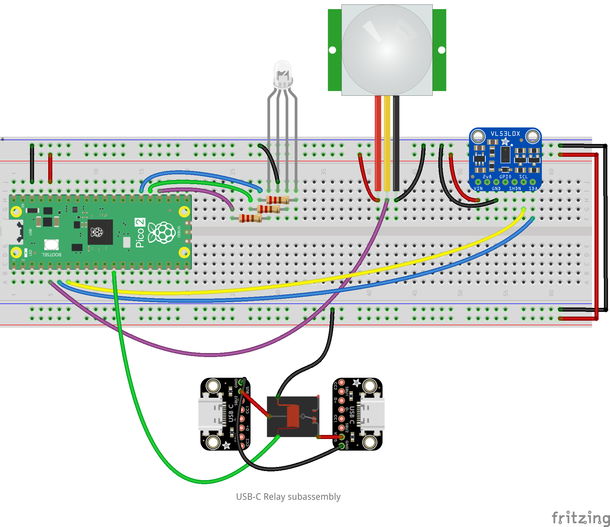
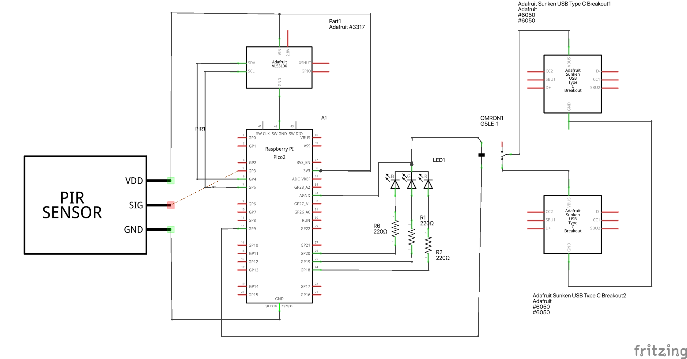

# Stillness Detector – Documentation


---

## Overview

The **Stillness Detector** is an interactive sensor system that detects whether a person is present and standing still. It is intended for triggering interactive art pieces or installations **only** when a viewer is standing motionless in front of the artwork. The device uses:

- A **time-of-flight distance sensor** (VL53L1X) to measure distance in millimeters
- A **passive infrared (PIR) motion sensor** to detect heat signatures
- A **Raspberry Pi Pico 2** microcontroller to run the logic
- **Status LEDs** and **digital outputs** to trigger external devices (art installations, lights, etc.)

---

## Hardware Quickstart

### *See [Hardware](#hardware) section for design files*

1. Power the stillness detector via its USB-micro connector labled "Power"
2. For controlling USB-C power, attach a power supply to the USB-C port marked "In", and a display device to the USB-C port marked "Out". Your display device will be powered whenever stillness is detected.
3. For controlling external microcontrollers, attach wires to the "Data" connector. At a minimum use "GND" for common ground and "Still" for output when stillness is detected. You can also use "Absent" which will be active when no person is detected, and "Present" which will be active when a person has been detected but they are not still yet.

<div style="display:flex; flex-wrap:wrap; gap:1rem; justify-content:space-between;">
    <figure style="width:32%; margin:0; text-align:center;">
        
        <figcaption>Stillness Detector with lid open</figcaption>
    </figure>
    <figure style="width:32%; margin:0; text-align:center;">
        
        <figcaption>Stillness Detector with lid closed</figcaption>
    </figure>
    <figure style="width:32%; margin:0; text-align:center;">
        
        <figcaption>Stillness Detector top view</figcaption>
    </figure>
    <figure style="width:32%; margin:0; text-align:center;">
        
        <figcaption>Stillness Detector time of flight and passive infrared sensors</figcaption>
    </figure>
    <figure style="width:32%; margin:0; text-align:center;">
        
        <figcaption>Stillness Detector USB-C power control input &amp; output</figcaption>
    </figure>
    <figure style="width:32%; margin:0; text-align:center;">
        
        <figcaption>Stillness Detector data output connectors</figcaption>
    </figure>
    <figure style="width:32%; margin:0; text-align:center;">
        
        <figcaption>Stillness Detector power and data ports</figcaption>
    </figure>
    <figure style="width:32%; margin:0; text-align:center;">
        
        <figcaption>Stillness Detector sensor connectors and status LEDs</figcaption>
    </figure>
</div>


## Software Quickstart

### Installation

1. **Download MicroPython firmware** onto your Pico 2:
   - Visit [micropython.org/download/rp2350](https://micropython.org/download/rp2350)
   - Hold `BOOTSEL` button, plug in USB, drag `.uf2` file to mount

2. **Copy files** to the Pico 2:
   ```
   vl53l1x.py         (sensor driver)
   settings.py        (configuration)
   main.py            (main program)
   ```

3. **Run the program:**
   - The Pico 2 will auto-run `main.py` on startup
   - Or use a serial terminal (e.g., Thonny IDE) and press Ctrl+D to reload

4. **Verify:**
   - Green status LED should blink briefly on startup
   - Aim your hand at the distance sensor; you should see serial output with distance readings

---

## Files & Entry Points

**Repository Structure**

```
stillness-detector/
├── main.py              # Main program logic and event loop
├── vl53l1x.py           # VL53L1X sensor driver (time-of-flight)
├── settings.py          # User-configurable parameters
├── README.md            # Quick reference
├── DOCUMENTATION.md     # This file
├── hardware/            # CAD and circuit design files
│   ├── Stillness_Detector_Enclosure_v1.0.scad
│   ├── stillness-detector.kicad_pcb
│   └── stillness-detector.kicad_sch
└── images/              # Diagrams and photos
```

### File Roles at a Glance

- **`main.py`**: Entry point. Initializes hardware, reads sensors in a loop, applies logic to determine presence/stillness state, and sets output pins.
- **`vl53l1x.py`**: Time-of-flight sensor driver. Handles I2C communication and distance measurements.
- **`settings.py`**: Tuning parameters for sensitivity, delay, and mode presets.

---

## Code Walkthrough

### 1. Initialization (main.py)

When the Pico 2 boots, `main.py` sets up all hardware components. Here's what happens:

**Sensor Setup**

```python
from machine import Pin, I2C
from vl53l1x import VL53L1X
import settings

# Initialize I2C (bus 0 on Pico 2)
i2c = I2C(0)

# Create sensor object; this establishes I2C communication
time_of_flight = VL53L1X(i2c)
```

**What this does:**
- `I2C(0)` creates an I2C bus using GPIO4 (SDA) and GPIO5 (SCL).
- `VL53L1X(i2c)` initializes the sensor driver and sends startup commands to the sensor.

**Why it's written this way:**
- The sensor needs I2C to communicate; both SDA and SCL are on specific pins.
- Wrapping in a try/except (in the real code) allows retries if the sensor isn't ready.

**Pin & LED Setup**

```python
class HardwareInterface:
    """
    Manages all hardware components for the stillness detector.
    
    This class encapsulates:
    - Motion sensor (PIR)
    - Status LED (onboard)
    - RGB LED indicator
    - Digital output pins for external devices
    """
    def __init__(self):
        self.motion_sensor = Pin(PIR_PIN, Pin.IN)
        self.status_led = Pin(STATUS_LED_PIN, Pin.OUT)
        self.rgb_leds = {
            "red": Pin(RED_LED_PIN, Pin.OUT),
            "green": Pin(GREEN_LED_PIN, Pin.OUT),
            "yellow": Pin(YELLOW_LED_PIN, Pin.OUT),
        }
        self.outputs = {
            "absent": Pin(ABSENT_OUTPUT_PIN, Pin.OUT),
            "present": Pin(PRESENT_OUTPUT_PIN, Pin.OUT),
            "still": Pin(STILL_OUTPUT_PIN, Pin.OUT),
        }
```

**What this does:**
- Wraps all pin definitions in a class for organization.
- Sets up three categories: input (motion sensor), debug LEDs, and output signals.

**Why it's written this way:**
- Grouping related pins makes the code easier to test, mock, and maintain.
- The dictionary structure lets you access LEDs by name (e.g., `self.rgb_leds["red"]`).

---

### 2. Configuration & Modes (settings.py)

The detector has three preset modes, plus a custom mode for advanced tuning.

```python
MODE = 'normal'  # options: "normal", "relaxed", "strict", "custom"

# Fallback for custom mode
SETTLING_DELAY = 5              # Seconds before stillness is armed after presence detected
DAMPING_INTERVAL = 7            # Ignore motion events within this interval (seconds)
ALLOWABLE_DISTANCE_CHANGE = 300 # Max movement in mm before stillness is cancelled
```

**Preset Modes**

```python
MODE_PRESETS = {
    "relaxed": {"settling_delay": 3, "damping_interval": 3, "allowable_distance_change": 1000},
    "normal":  {"settling_delay": 5, "damping_interval": 7, "allowable_distance_change": 300},
    "strict":  {"settling_delay": 10, "damping_interval": 20, "allowable_distance_change": 200},
}
```

**What this does:**
- `settling_delay`: How long the person must stand before "stillness" is triggered.
- `damping_interval`: Minimum time between motion events to ignore jitter.
- `allowable_distance_change`: Max forward/backward sway before stillness is lost.

**Why it's written this way:**
- Different art installations need different sensitivity. Presets let users pick without tweaking multiple values.
- `"relaxed"` is forgiving (wiggly people still count as still); `"strict"` requires near-total stillness.

---

### 3. Main Loop (main.py)

The core logic runs continuously:

```python
while True:
    # 1. Read distance from time-of-flight sensor
    distance = time_of_flight.read_distance()
    
    # 2. Check if distance is within detection range
    if MIN_DISTANCE <= distance <= MAX_DISTANCE:
        person_present = True
    else:
        person_present = False
    
    # 3. Check PIR sensor for motion
    motion_detected = motion_sensor.value() == 1  # Active high
    
    # 4. Apply state machine logic (simplified)
    if not person_present:
        state = "absent"
    elif motion_detected and time_since_motion < SETTLING_DELAY:
        state = "present"
    else:
        state = "still"
    
    # 5. Update output pins
    set_output_pins(state)
    
    # 6. Sleep to avoid flooding the loop
    time.sleep(0.1)
```

**What this does:**
- Reads distance and motion in each iteration.
- Compares distance to `MIN_DISTANCE` and `MAX_DISTANCE` from `settings.py`.
- Uses a state machine to determine if the person is absent, present (moving), or still.
- Updates output pins (GP7, GP8, GP9) based on the state.

**Why it's written this way:**
- A continuous loop allows real-time response to sensor changes.
- The state machine is clear: three states map to three output pins, making debugging easy.
- The `time.sleep(0.1)` prevents the loop from running so fast it floods the serial output.

---

### 4. Sensor Driver (vl53l1x.py)

The VL53L1X is a complex sensor. The driver abstracts away the I2C protocol.

**Key Method: `read_distance()`**

```python
def read_distance(self):
    """
    Read the distance in millimeters.
    
    Returns:
        int: Distance measurement in mm, or -1 if measurement failed.
    """
    # Request a new measurement
    self._write_register(RESULT_RANGE, measurement_data)
    
    # Wait for the sensor to be ready
    while not self._is_ready():
        time.sleep(0.001)
    
    # Read the raw distance from I2C
    distance_raw = self._read_register(DISTANCE_HIGH, 2)
    distance_mm = (distance_raw[0] << 8) | distance_raw[1]
    
    return distance_mm
```

**What this does:**
- Sends an I2C command to trigger a distance measurement.
- Waits for the sensor's ready flag (polling).
- Reads two bytes from the sensor (high byte and low byte).
- Combines them into a single 16-bit value.

**Why it's written this way:**
- The sensor requires a specific I2C protocol; this driver hides the complexity.
- MicroPython users can call `sensor.read_distance()` without knowing register addresses.
- The polling loop ensures the sensor has finished before we read the result.

---

**Key Insights**
1. Distance measurement happens on every loop iteration (every 0.1 seconds).
2. The state only changes after `SETTLING_DELAY` to avoid false positives.
3. PIR motion is one factor; distance drift is another (prevents stillness if person shifts by >300mm).
4. Output pins follow the state directly: only one output is active (low) at a time.

---

## Configuration & Tuning

### Quick Adjustments

**To make the detector more forgiving (accept more wiggling):**
```python
MODE = 'relaxed'  # in settings.py
```

**To make it stricter (require absolute stillness):**
```python
MODE = 'strict'
```

**For custom fine-tuning:**

Edit `settings.py`:

```python
MODE = 'custom'

SETTLING_DELAY = 3              # Reduce: person is "still" sooner
DAMPING_INTERVAL = 5            # Reduce: motion events closer together
ALLOWABLE_DISTANCE_CHANGE = 500 # Increase: more wiggle room allowed
```

### Understanding Each Parameter

| Parameter | Unit | Effect | Typical Range |
|-----------|------|--------|---------------|
| `SETTLING_DELAY` | seconds | Time before stillness is triggered after presence detected | 2–10 |
| `DAMPING_INTERVAL` | seconds | Minimum gap between motion events to filter noise | 3–20 |
| `ALLOWABLE_DISTANCE_CHANGE` | mm | Max forward/backward sway before stillness lost | 100–1000 |
| `MIN_DISTANCE` | mm | Nearest detection range (person too close = not detected) | 200–500 |
| `MAX_DISTANCE` | mm | Farthest detection range (person too far = not detected) | 1000–3000 |

### Tuning Tips

1. **Test your sensor range first:**
   - Connect to serial terminal (e.g., Thonny).
   - Observe `distance` every iteration.
   - Stand at different distances; note the readings.
   - Set `MIN_DISTANCE` and `MAX_DISTANCE` accordingly.

2. **Calibrate for motion sensitivity:**
   - Use `"strict"` mode initially.
   - Gradually relax if false negatives occur (stillness not triggered).
   - Reduce `ALLOWABLE_DISTANCE_CHANGE` if wiggling cancels stillness too often.

3. **Adjust settling time for UX:**
   - Shorter `SETTLING_DELAY` = faster trigger (snappier response).
   - Longer `SETTLING_DELAY` = more natural (person settles naturally).
   - 5 seconds is a good starting point.

---

## API Reference

### VL53L1X Driver (`vl53l1x.py`)

#### `VL53L1X(i2c_bus, address=0x29)`
Initialize the time-of-flight sensor.

**Parameters:**
- `i2c_bus`: MicroPython I2C object (e.g., `I2C(0)`)
- `address`: I2C address of the sensor (default: 0x29 for Adafruit module)

**Raises:** `OSError` if sensor not found on I2C bus.

**Example:**
```python
from machine import I2C
from vl53l1x import VL53L1X

i2c = I2C(0)
sensor = VL53L1X(i2c)
```

---

#### `read_distance()`
Perform a single distance measurement.

**Returns:**
- `int`: Distance in millimeters. Range: 0–4000 mm (typical).
- Returns `-1` if measurement failed.

**Example:**
```python
distance = sensor.read_distance()
if distance > 0:
    print(f"Distance: {distance} mm")
```

---

### Hardware Interface (`main.py` – `HardwareInterface` Class)

#### `set_led(color, state)`
Control a single RGB LED.

**Parameters:**
- `color`: `"red"`, `"green"`, or `"yellow"`
- `state`: `1` (off, active-low) or `0` (on)

**Example:**
```python
hw = HardwareInterface()
hw.set_led("red", 0)    # Turn red LED on
hw.set_led("red", 1)    # Turn red LED off
```

---

#### `set_output(output_name, state)`
Control an external output pin.

**Parameters:**
- `output_name`: `"absent"`, `"present"`, or `"still"`
- `state`: `1` (high, inactive) or `0` (low, active)

**Example:**
```python
hw.set_output("still", 0)  # Trigger the "still" output pin
```

---


## Troubleshooting & FAQ

### Problem: "Failed to initialize VL53L1X"

**Possible causes:**
1. Sensor not connected or wired incorrectly.
2. I2C lines (SDA/SCL) not pulled to 3.3V or shorted to GND.
3. Wrong I2C address.

**Debug steps:**
1. Double-check wiring: SDA → GP4, SCL → GP5, GND → GND, VCC → 3.3V.
2. Run an I2C scan to find the sensor address:
   ```python
   from machine import I2C
   i2c = I2C(0)
   devices = i2c.scan()
   print("I2C devices found:", [hex(d) for d in devices])
   ```
   Expected: `[0x29]` (VL53L1X) should appear.
3. If no devices found, check pull-up resistors on SDA/SCL (should be 4.7kΩ to 3.3V).

---

### Problem: Stillness never triggers (always "present")

**Possible causes:**
1. PIR sensor is misconfigured or not responding.
2. `SETTLING_DELAY` is too long.
3. Motion noise is constantly re-triggering.

**Debug steps:**
1. Print the state of the PIR sensor:
   ```python
   print(f"PIR value: {motion_sensor.value()}")
   ```
   Should read `0` when no motion, `1` when motion detected.
2. Reduce `SETTLING_DELAY` to 1–2 seconds and test.
3. Increase `DAMPING_INTERVAL` to filter noise.

---

### Problem: Distance readings are erratic or jump around

**Possible causes:**
1. Reflective surface or interference in front of sensor.
2. I2C timing issue (loose connection).
3. Too much electromagnetic noise.

**Debug steps:**
1. Move the sensor to a clear area with a matte (non-reflective) target.
2. Check all I2C connections; re-seat the sensor.
3. Add a filter: average the last 3 readings:
   ```python
   readings = []
   while len(readings) < 3:
       readings.append(time_of_flight.read_distance())
       time.sleep(0.05)
   smoothed_distance = sum(readings) // len(readings)
   ```

---

### FAQ

**Q: Can I increase the detection range to 5 meters?**

A: The VL53L1X sensor's typical max range is 2–3 meters outdoors. The driver limits it to 4000 mm. You can try:
```python
MAX_DISTANCE = 4000
```
But be aware: at long distances, accuracy drops, and false positives increase. Outdoor performance is worse than indoors.

---

**Q: How can I trigger multiple actions based on presence/still state?**

A: The three output pins (`ABSENT_OUTPUT`, `PRESENT_OUTPUT`, `STILL_OUTPUT`) can be wired to relays, MOSFETs, or other circuits. For example:
- Connect `STILL_OUTPUT` to a relay that turns on lights.
- Connect `PRESENT_OUTPUT` to a different relay that plays a sound.

Only one output is active at a time, so you can switch behaviors based on which pin goes high.

---

**Q: How do I modify the code to log data to a file?**

A: MicroPython supports file I/O on the Pico 2. Add this to `main.py`:

```python
with open("log.txt", "a") as f:  # "a" = append mode
    f.write(f"{time.time()},{distance},{state}\n")
```

Later, download `log.txt` from the Pico 2's storage via a serial connection.

---

**Q: Can I run this on a Raspberry Pi Zero or 4 instead?**

A: Yes, with modifications:
- Raspberry Pi runs full Linux + Python, not MicroPython.
- Use `board` and `busio` libraries instead of `machine` and `I2C`.
- Adapt pin names (e.g., `"GPIO3"` vs `Pin(3)`).
- The logic remains the same.

---

# Hardware

## Appendix A: Design Files

**Enclosure (CAD):**
- File: `hardware/Stillness_Detector_Enclosure_v1.0.scad`
- Format: OpenSCAD parametric design
- Use: 3D print or adapt dimensions for custom housing

**PCB (Circuit Design):**
- Files: `hardware/stillness-detector.kicad_sch` (schematic), `hardware/stillness-detector.kicad_pcb` (layout)
- Format: KiCad 8.0+
- Use: Order custom PCBs via JLCPCB, OSH Park, or similar

---
## Appendix B: Bill of Materials (BOM)

| Part | Quantity | Designation | Cost | Extended Cost | Supplier | Supplier and ref |
| --- | --- | --- | --- | --- | --- | --- |
| USB-C Receptacle TopMnt Horizontal | 2 | USB_C_PowerOnly | $0.60 | $1.20 | Digi-Key | 2073-USB4125-GF-A-0190CT-ND |
| NPN transistor | 1 | MMBT3904 | $0.07 | $0.07 | Digi-Key | 4878-MMBT3904CT-ND |
| 1206 resistor | 4 | 5.1k | $0.05 | $0.19 | Digi-Key | 311-5.10KFRCT-ND |
| 1206 resistor | 1 | 330 | $0.01 | $0.01 | Digi-Key | 311-330FRCT-ND |
| 1206 resistor | 3 | 220 | $0.01 | $0.03 | Digi-Key | 311-220FRCT-ND |
| 1206 resistor | 2 | 4.7k | $0.01 | $0.02 | Digi-Key | 311-4.70KFRCT-ND |
| MOSFET | 1 | DMG2301L | $0.16 | $0.16 | Digi-Key | DMG2301L-7DICT-ND |
| 4-pin terminal block | 1 | Screw_Terminal_01x04 | $1.63 | $1.63 | Digi-Key | ED10563-ND |
| Qwiic connector | 1 | Qwiic_RA | $0.42 | $0.42 | Digi-Key | 455-SM04B-SRSS-TBCT-ND |
| 3-pin terminal block | 1 | PIR Sensor Screw_Terminal_01x03 | $1.26 | $1.26 | Digi-Key | ED10562-ND |
| 1206 LED - yellow | 1 | LED-Y | $0.13 | $0.13 | Digi-Key | 160-1406-1-ND |
| 1206 LED - green | 1 | LED-G | $0.09 | $0.09 | Digi-Key | 160-1456-1-ND |
| 1206 LED - red | 1 | LED-R | $0.09 | $0.09 | Digi-Key | 160-1168-1-ND |
| Raspberry Pi Pico 2 WH | 1 | Raspberry Pi Pico 2 WH | $8.00 | $8.00 | Digi-Key | 2648-SC1634-ND |
| Female headers 20-pin for Pico | 2 | 20-position Female header | $0.85 | $1.70 | Digi-Key | 21601X20GSE |
| PIR Sensor | 1 | SR602 PIR | $2.00 | $2.00 | Amazon | B0FQ4ZXRZS |
| TOF Sensor | 1 | ACEIRMC TOF400C | $5.47 | $5.47 | Amazon | B0DC6M6G7W |
| PIR cables | 3 | F - M | $0.12 | $0.37 | Digi-Key | 1528-1161-ND |
| TOF cable Qwiic | 1 | Qwiic - male pins | $1.95 | $1.95 | Digi-Key | 1568-17912-ND |
| PCB | 1 |  | $8.92 | $8.92 | OSH Park | https://oshpark.com/shared_projects/h9REVbJo |

## Appendix C: Pinout Table

| Pin | Name | Direction | Purpose | Notes |
|-----|------|-----------|---------|-------|
| GP3 | PIR | Input | Motion sensor | Digital input; reads 1 when motion detected |
| GP4 | SDA | I/O | I2C data | Time-of-flight sensor communication |
| GP5 | SCL | I/O | I2C clock | Time-of-flight sensor communication |
| GP7 | ABSENT_OUTPUT | Output | External trigger | High when nobody detected |
| GP8 | PRESENT_OUTPUT | Output | External trigger | High when person detected but moving |
| GP9 | STILL_OUTPUT | Output | External trigger | High when stillness detected |
| GP18 | Red LED | Output | Debug indicator | Active-low (0=on) |
| GP19 | Green LED | Output | Debug indicator | Active-low (0=on) |
| GP20 | Yellow LED | Output | Debug indicator | Active-low (0=on) |
| 3.3V | Power | Supply | Sensors & LEDs | All components use 3.3V |
| GND | Ground | Supply | Common reference | Connect to all grounds |

---

## Appendix D: Breadboard diagram<br>



## Appendix E: Schematic<br>


*\* images created with Fritzing.*

## Appendix F: License & Credits

See [LICENSE](LICENSE) for full text.

This project uses:
- **MicroPython**: [micropython.org](https://micropython.org)
- **VL53L1X driver**: [github.com/drakxtwo/vl53l1x_pico](https://github.com/drakxtwo/vl53l1x_pico)

---

## Appendix G: Contributing

To report bugs or suggest improvements:

1. Test your changes locally first (use Thonny or similar).
2. Document any new settings with their effect and range.
3. Add a code comment explaining non-obvious logic.
4. Update this documentation if adding features.

For Pull Requests: Include a brief description of what changed and why.

---

**Questions?** Check the [Troubleshooting](#troubleshooting--faq) section or file an issue on GitHub.

Happy tinkering! 🎨
